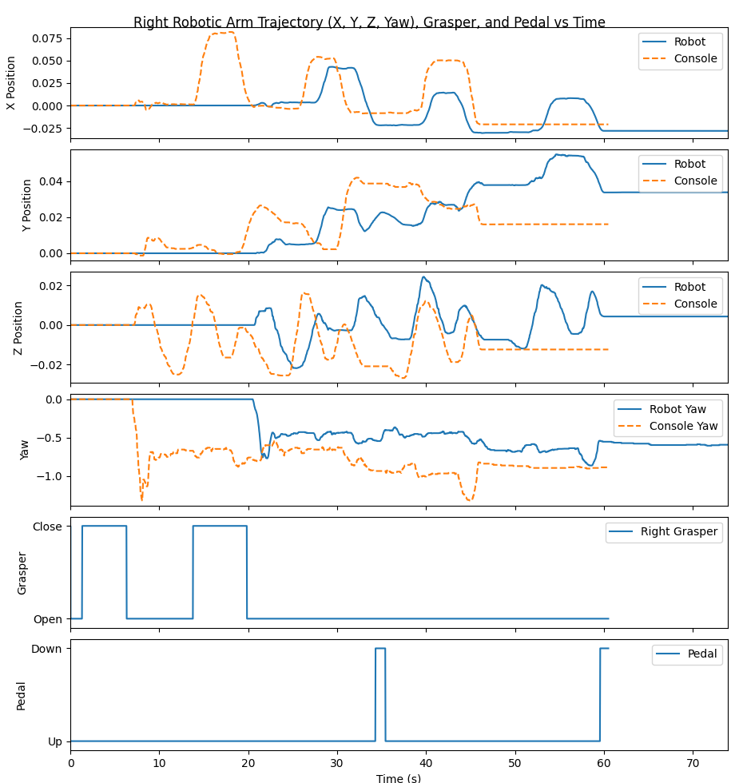

# Undergraduate Research Trial Task Submission
## 1. Summary
The simulator was set up in a native Ubuntu 22.04 installation. The replay file was recorded and analyzed. In the data visualization, the offset issue was fixed and the error between the robot and console data was quantified for a single run. The simulator was then modified to store rendered RGB, depth, and object segmentation data, which proved to have no noticeable impact on simulation performance, achieving stable 30 FPS even when storing every single frame.

## 2. Environment and Setup
Ubuntu 20.04 LTS has some issues installing drivers for my device, so I am running Ubuntu 22.04 LTS. My laptop has both an Intel and Nvidia GPU which seems to mess with the intended rendering pipeline, so certain code changes are made in each step to fix these issues. All code changes are numbered and referenced in the "Code Changes" section in the form CC#. Every other step is run as described in the task description or as described in this document if specified.

## 3. Part 1: Simulator Setup
A line was added to fix an X11 BadMatch error stemming from the mismatch between the Mesa display and the Nvidia graphics card (CC1).

Notably the simulator for the recorded replay was incredibly inconsistent. Oftentimes the claws failed to grab even a single peg. Since the replay stores the kinematics and not the actual positions of the claws, any difference exacerbates future differences. It is also likely the inconsistent framerate of the simulator increased the inconsistency.

A recording of both the GUI and the two terminal windows is saved in `./figures/TRIAL/replay.webm`.

## 4. Part 2: Data Visualization and Trajectory Comparison
| Left Arm | Right Arm |
|---|---|
|  |  |

The most notable difference in the plots of the trajectories is a delay between the original and replayed data of about 15 seconds. This is due to the time between choosing Bi-Peg Transfer and running replay.py, which the plots do not account for. To fix this we can start the plotting of the PSM kinematics only once the replay packets are actually sent, getting rid of the idle time where no movement is tracked. The plotting was changed to align when both recordings started (CC2).

| Left Arm (Aligned) | Right Arm (Aligned) |
|---|---|
|  |  |

Once this was completed, the horizontal shift was fixed, and we can see that all deltas caused by cumulative errors in the simulation add up, even though the movements largely are the same. This is enough to make the simulation fail at picking up the majority of the pegs in the majority of runs. The two most likely sources of this error that I can see are:
- Possible minute differences in timing (caused by inconsistent fps if the physics tickrate is tied to the simulation framerate for example)
- Differences in physics calculations (a collision in the replay creates an error that carries throughout the recording)

Since the scales for the data in the figures is different, it is hard to visually compare the error between variables. Thus to quantify the differences, the mean error was calculated for each relevant variable and printed out (CC3).
```
Arm          X        Y        Z      Yaw
-----  -------  -------  -------  -------
Left   0.00297  0.00332  0.00255  0.05288
Right  0.01190  0.00796  0.00801  0.17541
```

## 5. Part 3: Simulation Development
For storing renders, at each nth frame, the three frame layers are stored separately as three `.npy` files since they are `numpy` arrays. In each frame, frame data is stored to a buffer, which is flushed and all data written once the buffer reaches a critical size (CC6, CC7, CC8, CC9). By default, the interval between storing frames is 5 an the batch size for the buffer is 50. The buffer is used to decrease the write overhead costs. The folder of renders is stored in `telesurgery-qos-analysis/SurRoL_dVTrainer/tests/dVTrainer/Data/exp\_data\_15` by default with the other output data but can be configured to any hard-coded directory (See usage instructions).

In accordance with the task description, I calculated the loop frequency (as the inverse of the time between loops), the capture and write overhead, and the memory usage. All of the statistics are stored in the same directory as the renders. Below we can see the statistics for an interval of 1, meaning every frame is stored.
```
{
"args": {
	"interval": 1, 
	"batch_size": 50
	}, 
"stats": {
	"loop_frequency": {
		"min": 1.276754733223566, 
		"mean": 30.96325047000943, 
		"max": 40.95360099984377
	}, 
	"capture_overhead": {
		"min": 4.76837158203125e-07, 
		"mean": 1.1894613438620998e-06, 
		"max": 6.198883056640625e-06
	}, 
	"write_overhead": {
		"min": 0.007006645202636719, 
		"mean": 0.03974950530312278, 
		"max": 0.7331221103668213
	}, 
	"memory_usage": 57574902}}
```
We can see that the mean loop frequency is around 30, which meets our target of 30 fps. We can also see that a larger batch size generally leads to better performances as the write overhead is magnitudes larger than the capture overhead. However, this does lead to more memory usage, which is calculated through `tracemalloc`. (See performance profiling section for more detailed analysis)

Unfortunately due to disk space limitations I wasn't able to create a table of data for different levels of interval and batch size, but in general in running intervals of 1, 5, and 10 I saw no noticeable difference in simulation performance.

## 6. Code Changes
1. (multiple\_scenes\_console\_replay.py: Lines 9-10) Added Panda3D configuration to force Nvidia display.
2. (plot\_kinematics\_example.py: Line 69) Console time was zeroed to match robot starting time.
3. (plot\_kinematics\_example.py: Lines 72-85) Error is quantified and printed to a table.
4. (multiple\_scenes\_console\_replay.py: Line 2) Ignored Kivy args to allow for `argparse`.
5. (multiple\_scenes\_console\_replay.py: Lines 57-65) Added library imports and command line arguments.
6. (multiple\_scenes\_console\_replay.py: Lines 2153-2165) Added fields for rendering and performance analysis.
7. (multiple\_scenes\_console\_replay.py: Lines 2243-2279) Added helper functions for rendering and performance analysis.
8. (multiple\_scenes\_console\_replay.py: Lines 2300-2311) Store renders and calculate performance statistics.
9. (multiple\_scenes\_console\_replay.py: Lines 2532-2533) Write performance log and any remaining frames in the buffer on destroy.

## 7. Usage Instructions
Part 1  should be run exactly as described in the README. For part 2, install the following package before running `plot_kinematics_example.py`.
```
pip install tabulate
```

In part 3, `python multiple_scenes_console_replay.py` can be run with 3 possible command line arguments.
```
--interval (default=5) # specify interval between stored frames
--batch_size (default=50) # specify how often frame buffer is flushed
--out_dir (default=None) # specify where to store render data and statistics 
```
All other parts of running stay the same as specified in the README.

## 8. Results
In part 2, aligning the timing of the robot and console yielded the aligned figures as shown in that section. Quantifying the difference in one simulation run yielded the following table:
```
Arm          X        Y        Z      Yaw
-----  -------  -------  -------  -------
Left   0.00297  0.00332  0.00255  0.05288
Right  0.01190  0.00796  0.00801  0.17541
```
Here we can see that error is dominated by yaw, while the difference in the Cartesian position is largely variable per run.

In part 3, one run of the simulation at a resolution of `interval=1` is stored in the data folder as an example. Performance matched the benchmark of 30 fps, with more performance analysis expanded on in the next section.

## 9. Performance Profiling
For performance analysis in part 3, we can view the statistics logged in a run that stored every frame and wrote once every 50 frames.
```
{
"args": {
	"interval": 1, 
	"batch_size": 50
	}, 
"stats": {
	"loop_frequency": {
		"min": 1.276754733223566, 
		"mean": 30.96325047000943, 
		"max": 40.95360099984377
	}, 
	"capture_overhead": {
		"min": 4.76837158203125e-07, 
		"mean": 1.1894613438620998e-06, 
		"max": 6.198883056640625e-06
	}, 
	"write_overhead": {
		"min": 0.007006645202636719, 
		"mean": 0.03974950530312278, 
		"max": 0.7331221103668213
	}, 
	"memory_usage": 57574902}}
```
Min and max loop frequency can generally be ignored. They are extreme outliers generally occuring at the very beginning or end of the replay. The mean frequency of 30.963 is a very good sign. Even at the most extreme requirement of storing every frame, the simulation performance has no noticeable slowdowns in the framerate.

For the capture and write overhead, we can see that the write overhead dominates time spent for storing the data. This is expected; the simulation already retrieved the renders from `p.getCameraImage()`, so all the capture overhead is timing is the time it takes to append to an array, which is negligible compared the the file writing. For a batch size of 50 and an interval of 1, we write every 50 frames, which at 30 fps is every 1.667 seconds. Compared to this time, the 0.040 seconds spent on writing is almost negligible.

At a batch size of 50, memory usage peaks at around 57.575 MB. This is reasonable and is only a bit over the expected peak buffer size given a batch size of 50.

## 10. Tests
In each part simulations were run roughly 5-10 times to test consistency of the performance. Although the actual simulation replays varied wildly, analysis in both parts 2 and 3 matched expected results fairly well. Due to the scale of the changes, most of the validity tests were carried out informally. For example, sanity checks for loop time, overhead, positions, and function calls were printed to the terminal, then the prints were removed in the final iteration once issues were resolved.

## 11. Limitations and Future Improvements
In part 2, in the future we can try further minimizing the difference between the robot and console. To attempt to minimize this, one approach that may be taken is to fix the physics tickrate for the input device and match it in the replay file as well as the simulation environment, which should reduce randomness from timing variability.

For part 3, due to dual boot disk space constraints I wasn't able to run as many performance tests in part 3 as I would have liked. Originally, my plan was to get performance metrics at interval levels `[1,2,5,10]` and batch size levels `[1,10,50,100]`. In the future, once my secondary laptop (running Ubuntu natively without a Windows install to eat up disk space) is fixed this can be done. Once the data is collected, in the future we can perform some statistical analysis on the variables or try to optimize the parameters for any performance metric or some weighted average of all four.

Aside from this data collection, in the future this data collection and performance analysis can easily be copied over to the other simulation environments rather than just the Bi-Peg Transfer scenario.

## 12. GenAI Use Disclosure
(CC3): Claude was used to fix the `np.interp()` call and format the table with `tabulate()`.

(CC5): Use of `tracemalloc` was motivated by suggestion of Claude.

(CC7): Padding filenames with `:06d` was motivated by suggestion of Claude.

(CC7): Claude was use to fix a conversion error with `numpy` and `json`.
