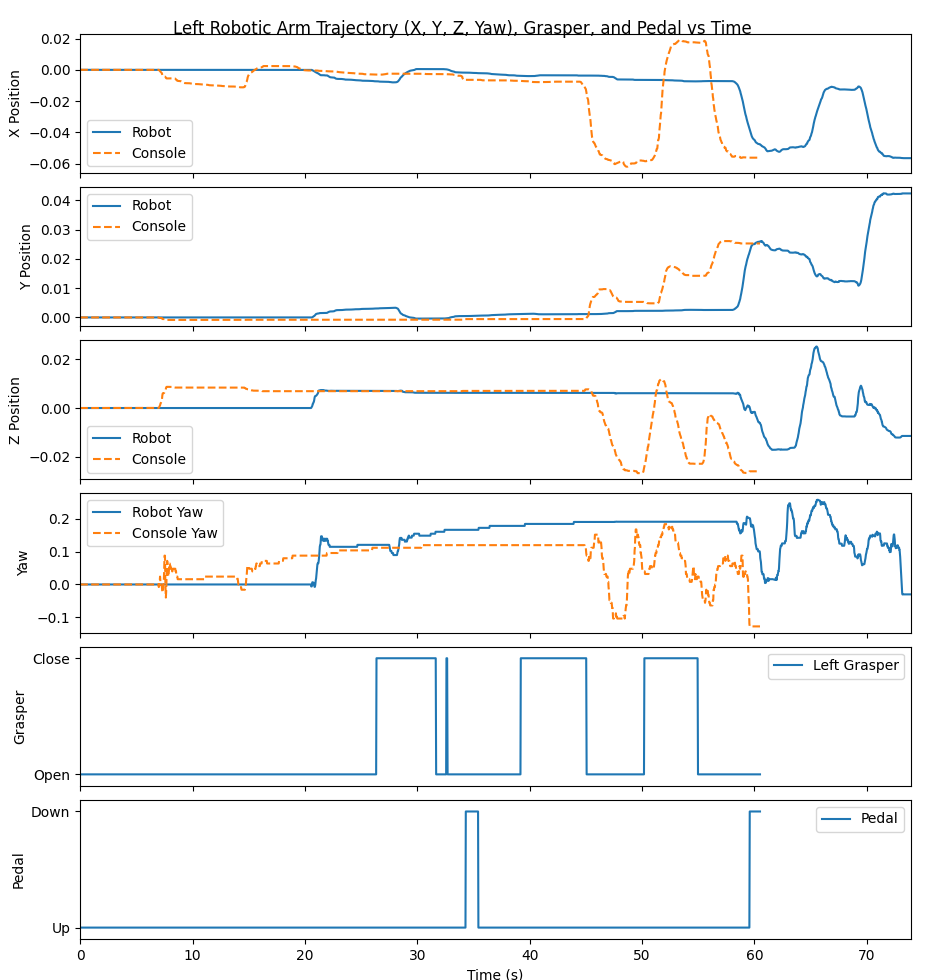
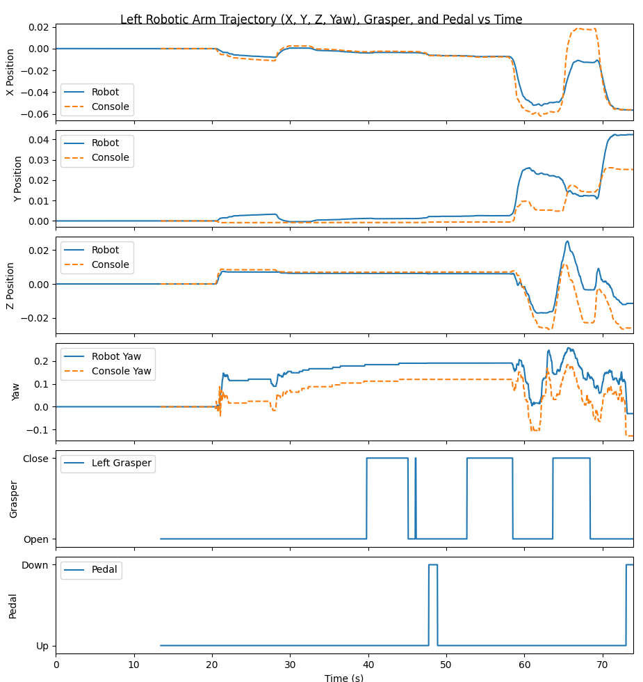
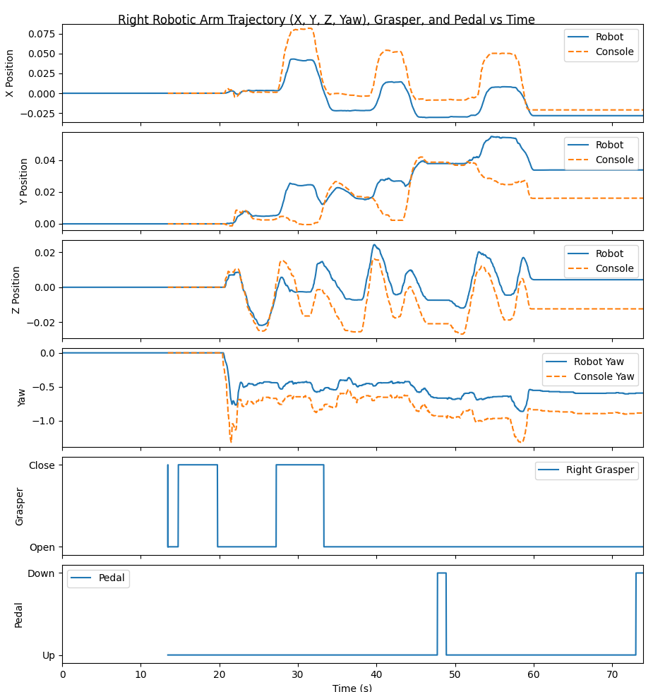

# Undergraduate Research Trial Task Submission
## 1. Summary
## 2. Environment and Setup
Ubuntu 20.04 LTS has some issues installing drivers for my device, so I am running Ubuntu 22.04 LTS. My laptop has both an Intel and Nvidia GPU which seems to mess with the intended rendering pipeline, so certain code changes are made in each step to fix these issues. All code changes are numbered and referenced in the "Code Changes" section in the form CC#. Every other step is run as described in the task description or as described in this document if specified.

## 3. Part 1: Simulator Setup
A line was added to fix an X11 BadMatch error stemming from the mismatch between the Mesa display and the Nvidia graphics card (CC1).

Notably the simulator for the recorded replay was incredibly inconsistent. Oftentimes the claws failed to grab even a single peg. Since the replay stores the kinematics and not the actual positions of the claws, any difference exacerbates future differences. It is also likely the inconsistent framerate of the simulator increased the inconsistency.

## 4. Part 2: Data Visualization and Trajectory Comparison
|---|---|
|  | ![(./figures/TRIAL/Figure_2.png) |

The most notable difference in the plots of the trajectories is a delay between the original and replayed data of about 15 seconds. This is due to the time between choosing Bi-Peg Transfer and running replay.py, which the plots do not account for. To fix this we can start the plotting of the PSM kinematics only once the replay packets are actually sent, getting rid of the idle time where no movement is tracked. The plotting was changed to normalize when both recordings started (CC2).

|---|---|
|  |  |

Once this was completed, the horizontal shift was fixed, and we can see that all deltas caused by cumulative errors in the simulation add up, even though the movements largely are the same. This is enough to make the simulation fail at picking up the majority of the pegs in the majority of runs. The two most likely sources of this error that I can see are:
- Possible minute differences in timing (caused by inconsistent fps if the physics tickrate is tied to the simulation framrate for example)
- Differences in physics calculations (a collision in the replay creates an error that carries throughout the recording)

Since the scales for the data in the figures is different, it is hard to visually compare the error between variables. Thus to quantify the differences, the mean error was calculated for each relevant variable and printed out (CC3).
```
Arm          X        Y        Z      Yaw
-----  -------  -------  -------  -------
Left   0.00297  0.00332  0.00255  0.05288
Right  0.01190  0.00796  0.00801  0.17541
```

## 5. Part 3: Simulation Development
## 6. Code Changes
1. (multiple\_scenes\_console\_replay.py: Lines 8-9) Added Panda3D configuration to force Nvidia display.
2. (plot\_kinematics\_example.py: Line 69) Console time was zeroed to match robot starting time.
3. (plot\_kinematics\_example.py: Lines 72-85) Error is quantified and printed to a table.
## 7. Usage Instructions
Part 1  should be run exactly as described in the README. For part 2, instal the following package before running `plot_kinematics_example.py`.
```
pip install tabulate
```

## 8. Results
## 9. Performance Profiling
## 10. Tests
## 11. Limitations and Future Improvements
## 12. GenAI Use Disclosure
